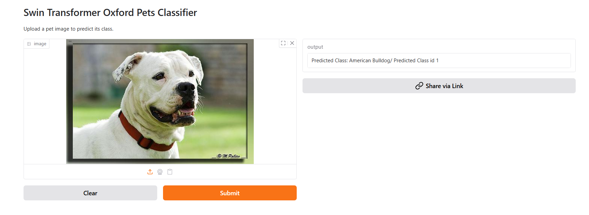

## Overview

This folder demonstrates how to deploy a PyTorch-trained image classification model using Gradio and Hugging Face Spaces.

Users can upload an image, and the app will predict the most likely class.

This app is hosted live on [Hugging Face Spaces](https://huggingface.co/spaces/AlejandroMeza1708/Swin-transformer-Oxford-Pets).

---

##  Model Details

- Framework: **PyTorch**
- Model: Swin Transformer fine-tuned with the Oxford-pets dataset
- Task: **Image Classification**
- Input: Image files (jpg, png)
- Output: Predicted class name and class ID

---
## How can you deploy this model?

- Create a hugging face account
- Create a personal hugging face space
- Upload the requirements.txt and the app.py file
- Obtain the .pth file with the weights of the model executing the notebook located in the fine-tuned-swin-transformer folder
---




## How to Run Locally ? 

If you want to run this app on your local machine:

If you want to run this app on your local machine:

```bash
# 1. Clone the repository
git clone https://github.com/YOUR-USERNAME/YOUR-REPO-NAME.git
cd YOUR-REPO-NAME

# 2. Install the dependencies
pip install -r requirements.txt

# 3. Run the app
python app.py


