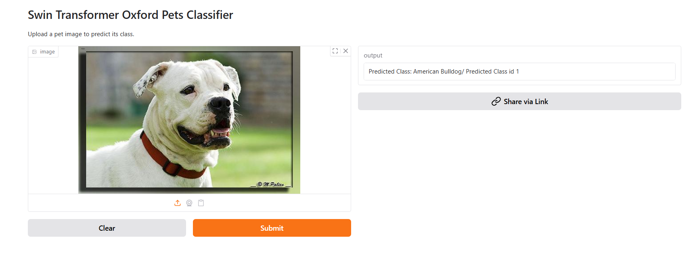
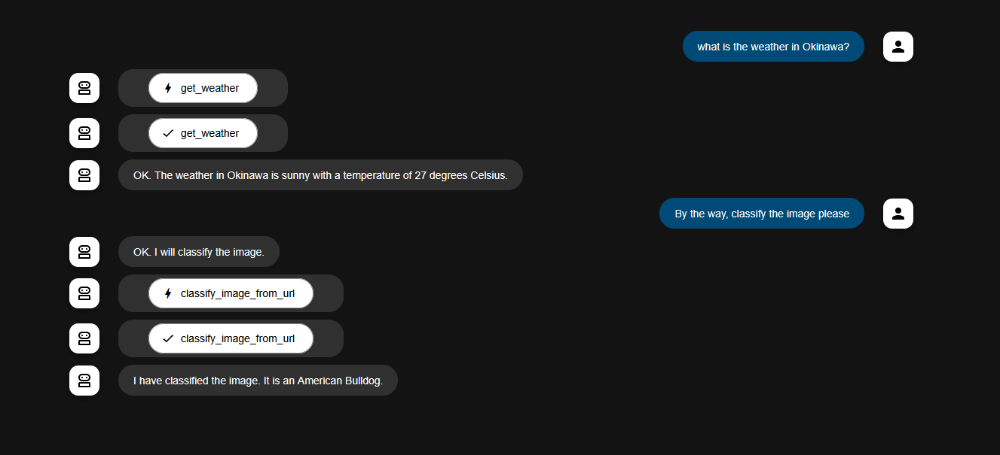

# Vision Transformer (ViT) Implementation

Author: Alejandro Meza Tudela

This repository offers a comprehensive step-by-step implementation of the Vision Transformer (ViT), developed entirely from scratch using PyTorch.

The objective is to provide a clear understanding of the Vision Transformer architecture by breaking it down into digestible, manageable components. The accompanying Jupyter Notebook includes:

- Interactive, hands-on code examples

- Detailed inline explanations

- Real-world training demonstrations using the Oxford-IIIT Pet Dataset

In addition, the project highlights the usage of a pre-trained Swin Transformer model, showcasing how to fine-tune it for custom datasets.

Furthermore, it introduces the concept of AI agents with practical implementations, providing insight into integrating Swin Transformers for image classification tasks within an agent-based architecture.

---

## 📘 ViT Notebook Overview

The ViT notebook walks through the following steps:
- ✅ **Patch Embeddings:** Understanding how patch embeddings work via `Conv2D` projection.
- ✅ **Multi-Head Self Attention:** Implementing multi-head self-attention manually.
- ✅ **MLP Feedforward Block:** Building a custom MLP (Multi-Layer Perceptron) block.
- ✅ **Transformer Encoder:** Composing the full transformer encoder.
- ✅ **Vision Transformer Model:** Assembling the complete Vision Transformer model.
- ✅ **Training & Validation:** Training and evaluating the model on the **Oxford-IIIT Pet Dataset**.

---

## 📘 Swin Transformer Notebook Overview

The Swin Transformer notebook walks through:
- ✅ **Loading the Data:** Preparing the dataset for training.
- ✅ **Understanding Swin Transformer:** Exploring the unique characteristics of the Swin Transformer model.
- ✅ **Pre-trained Model:** Loading a pre-trained Swin Transformer model.
- ✅ **Fine-tuning:** Fine-tuning the pre-trained model for a custom dataset.
- ✅ **Saving Weights & Predictions:** Saving the fine-tuned model weights and using the model to make predictions.

---
##  🤗 Hugging Face Folder
The Hugging Face folder contains the necessary components for deploying the fine-tuned Swin Transformer model as an interactive web application using Gradio on Hugging Face Spaces.

The primary objective of this folder is to provide a seamless interface for users to interact with the Swin Transformer model, upload images, and receive predictions in real-time. It also demonstrates how to deploy a pre-trained model within the Hugging Face platform.

---
##  🤖 Agent Folder

In addition to the main Swin Transformer training notebook, this repository also includes an agent/ folder.

- Inside the agent/ folder, the fine-tuned Swin Transformer model is loaded and wrapped into a Google ADK Agent.

- The agent is designed to classify images by fetching them from URLs. (For demonstration purposes, it currently uses a hardcoded URL.) The model is used purely for inference, without any re-training.

This demonstrates how a trained ViT-based model like Swin Transformer can be integrated into a production-like agent environment.

-----
## 💾 Dataset

This project uses:
- 📦 **Oxford-IIIT Pet Dataset**  
A dataset of pet images annotated with class labels and pixel-level segmentation masks.

Official link: [Oxford-IIIT Pet Dataset](https://www.robots.ox.ac.uk/~vgg/data/pets/)

---
